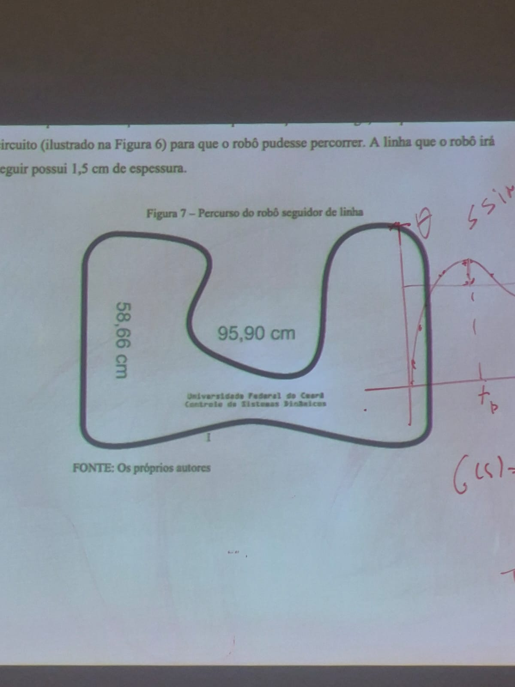
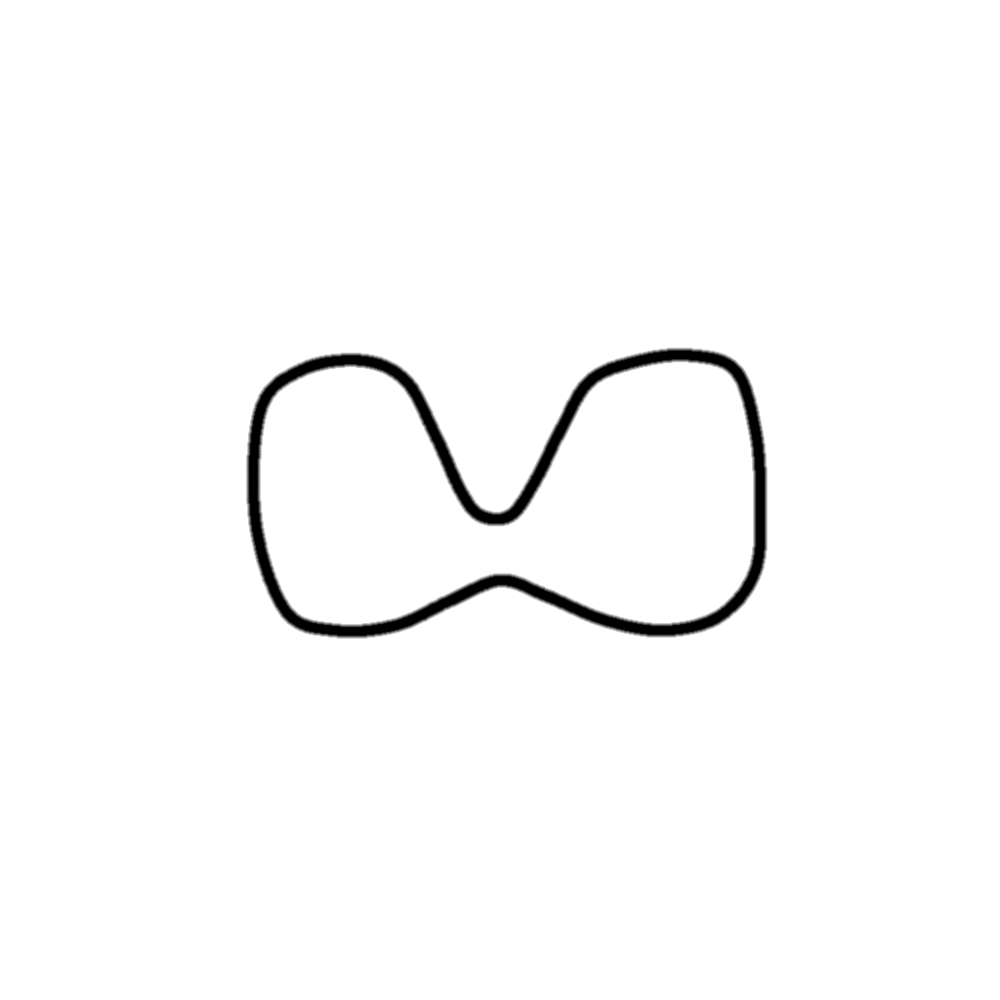
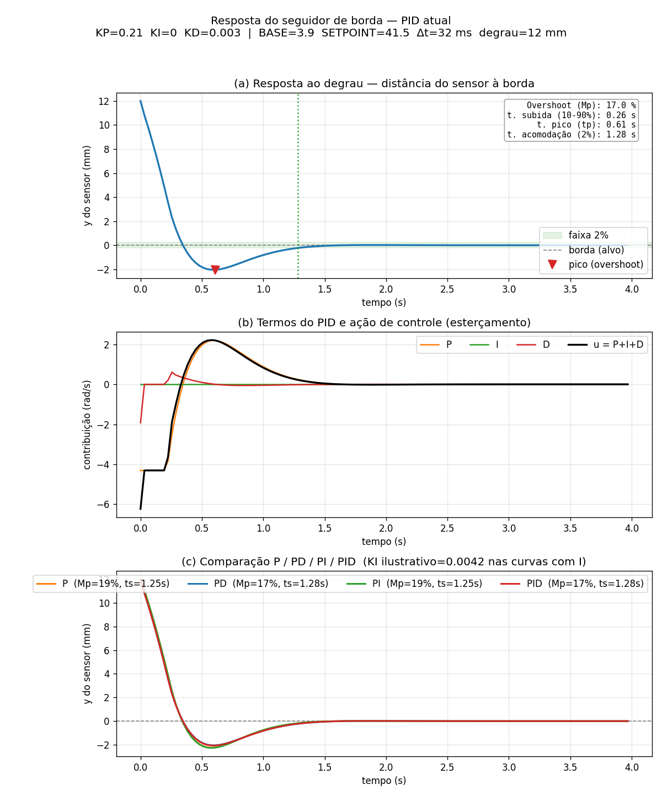

# Seguidor de Linha EV3 no Webots (controle PID)

Simulação de um robô **seguidor de linha** no **Webots R2025a**, usando o modelo
oficial do **LEGO Mindstorms EV3** (`MindstormsRover`). O robô percorre um
circuito fechado fazendo **seguimento de borda** com **um único sensor de chão**,
controlado por um **PID parametrizável** (dá para reduzir a P, PI, PD ou PID e
comparar as respostas).

O traçado reproduz o circuito proposto na disciplina (≈ 95,90 × 58,66 cm, linha
de 1,5 cm de espessura):

| Circuito de referência | Pista gerada (textura) |
| --- | --- |
|  |  |

## Requisitos

- **Webots R2025a** (testado via instalação por snap: `/snap/bin/webots`).
- **Python 3** (o controlador roda no interpretador embutido do Webots).
- Para o script de análise: **numpy** e **matplotlib**.

## Como rodar a simulação

```fish
webots worlds/controle.wbt
```

Dê **Play**. O robô começa na lateral direita do circuito, com o sensor sobre a
borda da linha, e segue o traçado. Na primeira abertura o Webots baixa o PROTO do
robô e os fundos a partir do GitHub (precisa de internet).

> O EV3 é pequeno (~5 cm); use o scroll para dar zoom e ver o robô.

## Estrutura

```
worlds/
  controle.wbt              # cena: arena, pista (textura) e o robô MindstormsRover
  textures/
    gerar-pista.py          # gera a textura da pista (pista.png) sem dependências
    pista.png               # textura aplicada ao chão (necessária para rodar)
    pista-objetivo.jpeg     # imagem de referência do circuito
controllers/
  seguidor-linha/
    seguidor-linha.py       # controlador PID de seguimento de borda
analise/
  gerar-graficos.py         # simula a resposta e plota (lê os ganhos do controlador)
  resposta-pid.png          # gráfico gerado
```

## O controlador (PID de borda)

Arquivo: [`controllers/seguidor-linha/seguidor-linha.py`](controllers/seguidor-linha/seguidor-linha.py)

Com um único sensor, o robô mantém a leitura sobre a **borda** (fronteira
preto/branco). O erro é `e = leitura - SETPOINT`, e a ação de esterçamento é:

```
u(t) = Kp·e(t) + Ki·∫e dt + Kd·de/dt
roda_esquerda = BASE + u
roda_direita  = BASE - u
```

### Experimentar P / PI / PD / PID

Basta zerar ganhos no bloco de parâmetros:

| Variante | Ajuste |
| --- | --- |
| **P** | `KI = 0.0` e `KD = 0.0` |
| **PD** | `KI = 0.0` |
| **PI** | `KD = 0.0` |
| **PID** | os três diferentes de zero |

### Calibração e velocidade

- `SETPOINT` é o ponto médio entre as leituras do branco e do preto (medidas no
  console: ~21 e ~62). Descomente o `print` no fim do arquivo para recalibrar.
- Para mudar a velocidade, multiplique `BASE`, `KP`, `MAX_SPEED` e `MIN_SPEED`
  pelo mesmo fator e **mantenha o `KD`** (o termo derivativo já cresce com a
  velocidade). Assim o raio das curvas se preserva.

## A pista

A textura é gerada por [`worlds/textures/gerar-pista.py`](worlds/textures/gerar-pista.py)
(apenas biblioteca padrão do Python). O traçado é uma spline fechada definida em
`PONTOS_CM`; a linha tem um **núcleo preto** com **borda em gradiente**, que dá ao
sensor uma leitura analógica (essencial para o PID funcionar de verdade).

```fish
cd worlds/textures
python3 gerar-pista.py        # regenera pista.png
```

## Análise da resposta

[`analise/gerar-graficos.py`](analise/gerar-graficos.py) **lê os ganhos atuais**
dos arquivos do projeto, simula o laço fechado (planta cinemática + PID) e plota a
**resposta ao degrau**, a contribuição de cada termo e a comparação P/PD/PI/PID,
com métricas automáticas (overshoot, tempo de subida, de pico e de acomodação 2%).

```fish
python3 analise/gerar-graficos.py   # gera analise/resposta-pid.png
```



## Autoria

**Inácio Rodrigues de Matos Galvão**
